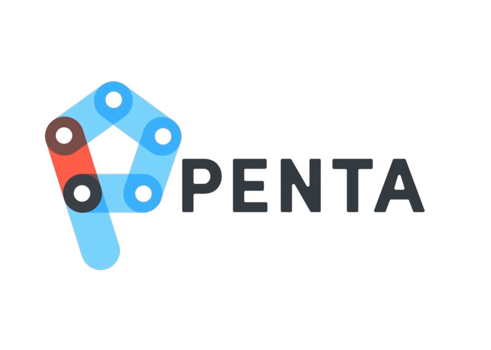

# Inventory Request System

## Table of Contents

- [Introduction](#introduction)
- [Getting Started](#getting-started)
  - [Prerequisites](#prerequisites)
  - [Installation](#installation)
- [Committing Changes, Building, and Deploying](#committing-changes-building-and-deploying)
- [Code Documentation](#code-documentation)
  - [Project Structure](#project-structure)
  - [Main Components](#main-components)
  - [State Management](#state-management)
  - [Data Fetching](#data-fetching)
- [Usage](#usage)
  - [Using Item Cards](#using-item-cards)
  - [Requesting Items](#requesting-items)
  - [Navigation](#navigation)
  - [Interacting with the Inventory](#interacting-with-the-inventory)

## Introduction

The **Penta Prosthetics Inventory Request System** is a web-based application developed to address specific challenges related to inventory requesting for Penta’s Partners. This project aims to provide an intuitive, feature-rich solution that streamlines the inventory requesting process. The primary objectives include:

- **Enhanced Inventory Search**: Create a system that allows users to easily search for items within the inventory.
- **Detailed Item Information**: Provide comprehensive and searchable item details.
- **Advanced Filtering**: Implement a robust filtering system for refining searches.
- **Cart Integration**: Allow users to add and manage items in a cart.
- **Inventory Availability**: Real-time inventory availability checks.
- **Partner Requests**: Partner affiliates can submit inventory requests.

## Getting Started

### Prerequisites

Before you begin, ensure you have met the following requirements:

- Node.js: Make sure you have Node.js installed on your system. You can download it from [nodejs.org](https://nodejs.org/).

### Installation

1. **Clone the repository:**

   ```bash
   git clone https://github.com/jcp215033/penta-prosthetics.git
   ```

2. **Install Dependencies:** Navigate to the project folder and install the required dependencies.

   ```bash
   cd penta-prosthetics
   npm install
   ```

3. **Create the .env File:** In the project root directory, create a .env file.

4. **Edit the .env File:**
   Open the .env file in a text editor.
   Create a REACT_APP_API_KEY variable and replace with Penta's AirTable personal access token.
   Note: Be cautious with API keys, PATs, and sensitive information. Do not commit your .env file to version control (e.g., Git) to keep your secrets secure.

5. **Secrets in GitHub:** It's essential to keep your secrets safe. Avoid exposing your API keys or sensitive data in your GitHub repository. If you suspect that your API keys or any other sensitive information stored in GitHub Secrets has been compromised, it's essential to take immediate action to update and secure it. Revoke the current Personal Access Token in AirTable and create a new one.
   In the GitHub repository, navigate to the "Settings" tab, typically located in the top right corner of the repository's main page and find "Secrets". Rename VITE_REACT_APP_API_KEY to the new personal access token, update your .env as well and redeploy these changes.

6. **Start the Development Server:** Start the development server to run the application locally.

   ```bash
   npm run dev
   ```

7. **Access the Application:** Open your web browser and access the application at localhost:5173/penta-prosthetics/.

### Committing Changes, Building, and Deploying

After making changes to the Penta Inventory Request System, you'll need to commit those changes to the Git repository, build the static files, and deploy to GitHub Pages. Follow these steps:

1. **Commit Changes:** Once you've made your desired changes, commit them using Git. First, add the files you want to commit:

   ```bash
   git add .
   ```

   Next, commit your changes with a meaningful commit message:

   ```bash
   git commit -m "Your commit message here"
   ```

2. **Push to GitHub:** Push your committed changes to your GitHub repository:

   ```bash
   git push origin master
   ```

   Replace 'master' with your preferred branch name if you're working on a different branch.

3. **Build Static Files:** Before deploying, build the static files for production using the following command:

   ```bash
   npm run build
   ```

   This command will generate optimized and minified files in the dist directory.

4. **Deploy to GitHub Pages:** The web app is configured to be deployed for GitHub Pages. Run the following command to deploy your changes:

   ```bash
   npm run deploy
   ```

   This command will automatically push the contents of the dist directory to the gh-pages branch of your GitHub repository. It may take a few moments to complete.

5. **Access the Deployed Application:** Once the deployment is complete, you can access your deployed application on GitHub Pages at the following URL:

   ```arduino
   https://jcp215033.github.io/penta-prosthetics/
   ```

   Now your changes are committed, built, and deployed to GitHub Pages, making them accessible to others. Make sure to follow these steps whenever you want to update the live version of the web app.

## Code Documentation

This section provides an overview of the key components and structure of the Penta Prosthetics Inventory Request System codebase. Understanding the code structure will help you navigate and make modifications if needed.

### Project Structure

The codebase of the Penta Prosthetics Inventory Request System is organized into several main directories:

- **src**: Contains the main source code for the application.
  - **assets**: Stores static assets like images and logos.
  - **components**: Houses React components used throughout the application, such as cards, filters, and the shopping cart.
  - **context**: Contains the React context API setup for managing global states.
  - **pages**: Includes the main application pages, such as the home page and the cart page.
- **dist**: Generated production build files.

### Main Components

The application is composed of several main components:

- **App.js**: The root component that sets up routing and manages the overall application state.
- **Home.js**: Displays inventory as cards.
- **Cart.js**: Displays saved items and allows requesting.
- **Partner.js**: Partner selection page.
- **NavBar.js**: The navigation bar component that displays the application logo and shopping cart.
- **SideBar.js**: The sidebar component responsible for applying filters and managing the size range.

### State Management

The application uses React Context API for state management. The key states include:

- **PentaContext**: The global context that holds state variables such as selected filters, cart items, and partner information. This context is used to share data between components.

### Data Fetching

The application fetches data from Airtable using the Airtable API. Data fetching is primarily handled in the following components:

- **Home.js**: Fetches and displays the inventory items on the home page.
- **Cart.js**: Checks item availability and facilitates the item request process.

## Usage

This user manual will guide you through each step of using our solution. Whether you're searching for items or managing your cart, we've got you covered.

1. **Open the Site**: Simply open the Inventory Request System website. [https://[Penta-GitHub-Username].github.io/penta-prosthetics/](https://jcp215033.github.io/penta-prosthetics/)
2. **Loading Items**: The system will automatically load items sorted from oldest to newest.
3. **Multiple Quantity Items**: Items with multiple pieces available will be indicated with a badge on the upper right.
4. **Item Cards**: Each item card provides all the available data. Some cards may have more information than others.

### Using Item Cards

1. **Google Search Button**: Each item card has a Google search button on its left. Clicking it will show images of what the item most likely looks like. The more details the card provides, the more accurate the search will be.
2. **Add/Remove from Cart**: In each item card, you'll find a button on the right to add or remove items from your cart depending on if the item is already in your cart or not.
3. **Cart Cards**: Cards can be removed from the cart from both the home page and the cart page.
4. **Unavailable Cards**: In the case that an item in a cart becomes reserved or unavailable, it will display a banner showing its out of stock status. This card needs to be removed from the cart before you can checkout.

### Requesting Items

1. **Selecting a Partner**: When navigating to the cart on your first visit, you'll be prompted to pick a Partner. Any other time partner selection can be changed with the “Change Partner” button, it's also stored in local storage to remember your choice across visits.
2. **Notes**: Additional notes for requests are saved in local storage to allow you to save your notes until you check out.
3. **Saving Items**: Items are also saved in local storage, ensuring they remain in your cart between visits. They are removed from local storage once the user checks out, along with notes. Checkout does not remove the saved Partner.
4. **Checkout Process**: When requesting items, several checks are in place to ensure you have everything in order to check out. A notification will appear to tell you what you are missing. In order to successfully request items from the cart page, a partner must be selected, at least one in-stock item is in your cart, and you have filled out additional notes.
5. **Clearing Local Storage**: Checking out will clear local storage for notes and items, but it won't affect your selected partner.

### Navigation

1. **Pagination**: There are two sets of pagination. The bottom buttons allow you to quickly navigate back to the top for easier access.
2. **Mobile-Friendly**: The site is designed to be mobile-friendly, so feel free to use it on various platforms.

### Interacting with the Inventory

1. **Applying Filters**: Refine your search by using the filtering options provided. The three buttons displayed on the front page allow you to filter items by their tags, specifically Prosthesis, Orthosis, and Pediatric. Additionally, clicking the "Filters" button on the right side of the screen expands a sidebar with further filtering possibilities. Within the sidebar, you have the flexibility to search and select multiple manufacturers and descriptions from SKU. You can also toggle the size option to narrow your search within a specified size range, ensuring that you find the items that best fit your requirements. A count of how many filters you have is displayed in the filters button. You can also remove all filters with the “Reset Filters” button.
2. **Using the Search**: To find specific items, use the search feature located at the top of the page to narrow down your search. Enter keywords included in an item’s ID, manufacturer, SKU, description, and size.
3. **Combining Search and Filters**: For even more precise results, combine the search and filters.
4. **Downloading Inventory**: Partners can download inventory results in .csv or .xlsx formats for personal access to the data. If no filters are selected, the entire inventory is downloaded. Otherwise whatever filters, and/or search you have will be the criteria for what is downloaded.
