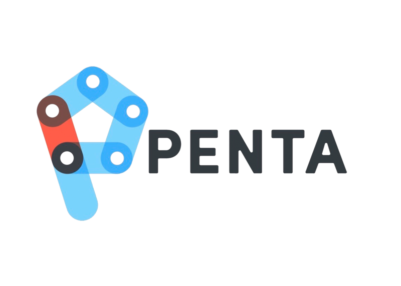

# Inventory Request System

## Table of Contents

- [Introduction](#introduction)
- [Getting Started](#getting-started)
  - [Prerequisites](#prerequisites)
  - [Installation](#installation)
- [Operations](#operations)
   - [Production Configuration and Security](#production-configuration-and-security)
   - [Managing SKU Group Cards](#managing-sku-group-cards)
   - [Maintenance and Announcements](#maintenance-and-announcements)
   - [Building and Deploying](#building-and-deploying)
- [Code Documentation](#code-documentation)
  - [Project Structure](#project-structure)
  - [Main Components](#main-components)
  - [State Management](#state-management)
  - [Data Fetching](#data-fetching)
- [Testing](#testing)
- [Usage](#usage)
  - [Using Item Cards](#using-item-cards)
  - [Requesting Items](#requesting-items)
  - [Navigation](#navigation)
  - [Interacting with the Inventory](#interacting-with-the-inventory)
  - [Resources](#resources)

## Introduction

The **Penta Medical Recycling Inventory Request System** is a web-based application developed to address specific challenges related to inventory requesting for Penta’s Partners. This project aims to provide an intuitive, feature-rich solution that streamlines the inventory requesting process. The primary objectives include:

- **Enhanced Inventory Search**: Create a system that allows users to easily search for items within the inventory.
- **Detailed Item Information**: Provide comprehensive and searchable item details.
- **Advanced Filtering**: Implement a robust filtering system for refining searches.
- **Cart Integration**: Allow users to add and manage items in a cart.
- **Inventory Availability**: Real-time inventory availability checks.
- **Partner Requests**: Partner affiliates can submit inventory requests.

## Getting Started

### Prerequisites

Before you begin, ensure you have met the following requirements:

- Node.js: Make sure you have Node.js installed on your system. You can download it from [nodejs.org](https://nodejs.org/).

### Installation

1. **Clone the repository:**

   ```bash
   git clone https://github.com/Penta-Medical-Recycling/inventory.git
   ```

2. **Install Dependencies:** Navigate to the project folder and install the required dependencies.

   ```bash
   cd inventory
   npm install
   ```

3. **Configure Airtable:** Copy `.env.example` to `.env.development.local` and set:

   ```dotenv
   VITE_REACT_APP_API_KEY=your-development-personal-access-token
   VITE_AIRTABLE_BASE_ID=appK4ByZCcahk46LM
   ```

   The shared development Airtable base is named **DEV ENVIRONMENT - INVENTORY** and has the base ID `appK4ByZCcahk46LM`. Use this base for local development. Files ending in `.local` are ignored by Git; never commit a personal access token.

4. **Start the Development Server:** Start the development server to run the application locally.

   ```bash
   npm run dev
   ```

5. **Access the Application:** Open your web browser and access the application at localhost:5173/inventory/.

## Operations

### Managing SKU Group Cards

Group cards are managed in the **SKU Groups** table in Airtable. Changes made there do not require a code change, build, or deployment. Refresh an already-open inventory browser tab to load the latest configuration.

SKU groups are optional. Inventory whose SKU is not assigned to an active group appears directly in the main inventory list as individual item cards. Create a group only when those items should be represented by a shared group card.

#### Airtable Fields

| Field | Type | How it is used |
| --- | --- | --- |
| Name | Primary text | Card title. Image accessibility text is generated from this value. |
| Key | Single line text | Stable URL identifier, such as `orthotics` or `adb-m`. |
| SKUs | Linked records | The SKU records included in the group. One link creates a single-SKU card; multiple links create a category card. |
| SKU Item Codes | Lookup | Read-only codes resolved from SKUs. The application uses these to query Inventory. This column may be hidden from the maintainer view, but must not be deleted. |
| Image | Attachment | Optional card image (remove background before uploading). A neutral placeholder appears when blank or unavailable. |
| Active | Checkbox | The card can appear only when checked and matching inventory is available. |

#### Adding an SKU Card

1. Create a record in **SKU Groups**.
2. Enter the user-facing **Name**.
3. Enter a unique lowercase **Key** using letters, numbers, and hyphens only, for example `adb-m`.
4. Link one or more records in **SKUs**. Select the existing SKU; do not create a duplicate SKU record.
5. Upload an **Image**, or leave it blank to use the placeholder.
6. Check **Active**.
7. Refresh the inventory site, locate the card, open it, and return with **All items**.

#### Add or Edit a Category

A category appears only when at least one member has inventory matching the current search and filters.

Each SKU should belong to at most one active group. Do not also create a single-SKU group for a SKU owned by a category. If overlap occurs, the application assigns the SKU to the first group alphabetically and logs a diagnostic; correcting the Airtable links is the permanent fix.

#### Rename, Hide, or Replace an Image

- Change **Name** to update the card title. Cards are always ordered alphabetically by Name.
- Do not change **Key** after publication unless breaking saved/shared group links is acceptable.
- Clear **Active** to hide a card temporarily instead of deleting it.
- Replace or remove the **Image** attachment at any time. A missing or broken image falls back to the placeholder.

#### Troubleshooting

| Problem | Check |
| --- | --- |
| Card is missing | Confirm Active is checked and at least one linked SKU has available inventory under the current filters. |
| Card shows a placeholder | Confirm Image has a valid Airtable attachment, then refresh the site. |
| Items appear as individual cards | Confirm the group loaded successfully, SKU Item Codes contains the intended codes, and the token can read SKU Groups. |
| Wrong items appear in a category | Remove the incorrect linked record from SKUs and select the exact intended SKU code. CSV imports can fuzzy-match similar codes. |
| A code appears in two groups | Remove it from one group; each SKU should have one active owner. |
| A configured code shows no items | It may have zero currently available inventory. This is expected for codes such as STAND until stock exists. |
| Airtable returns 403 | Grant the application personal access token read permission for the SKU Groups table. Never place the token in documentation. |
| A shared group URL no longer works | Restore the original Key or open the inventory overview; Name can be changed without affecting links. |

#### Maintainer Checklist

After changing a group: confirm its Name, Key, linked SKUs, Image, and Active value; refresh the site; verify the card and image; drill into the group; return with **All items** or browser Back; test relevant search/filters and mobile layout; and confirm adding an item still places a concrete inventory item in the cart.

### Maintenance and Announcements

The Airtable **Site-Status** table contains two records that the application reads in their current order:

1. **Announcement record:** Set **Status** to `Online` to show the notification control and display its **Message**. Set it to `Offline` to hide the announcement.
2. **Platform record:** Set **Status** to `Offline` to replace the application with the maintenance page and display its **Message**. Set it to `Online` to make the application available.

Do not delete or reorder these records without updating `src/context/PentaProvider.jsx`; the application currently identifies them by their position in the Airtable response. Refresh the deployed site after making a change to confirm the expected announcement or maintenance state.

### Building and Deploying

After making changes to the Penta Inventory Request System, commit them and deploy to GitHub Pages. Always use `npm run deploy` so the local test-and-build gate runs automatically.

1. **Commit Changes:** Commit the changes using Git. First, add the files you want to commit:

   ```bash
   git add .
   ```

   Next, commit your changes with a meaningful commit message:

   ```bash
   git commit -m "Your commit message here"
   ```

2. **Push to GitHub:** Push your committed changes to your GitHub repository:

   ```bash
   git push origin master
   ```

   Replace 'master' with your preferred branch name if you're working on a different branch.

3. **Deploy to GitHub Pages:** The web app is configured to be deployed to GitHub Pages. Run:

   ```bash
   npm run deploy
   ```

   Before deploying, provide `VITE_REACT_APP_API_KEY` and `VITE_AIRTABLE_BASE_ID` through the shell or a git-ignored `.env.production` file. npm automatically runs the `predeploy` script first, which rejects missing or placeholder production values, verifies read access to Airtable's `Site-Status` table and response shape, and then invokes `npm run verify`. Deployment stops if the environment check, Airtable contract check, Vitest suite, or production build fails. If verification passes, the command pushes the newly generated `dist` contents to the `gh-pages` branch. Invoking `gh-pages` directly bypasses this gate, so always deploy through `npm run deploy`.

4. **Access the Deployed Application:** Once the deployment is complete, you can access your deployed application on GitHub Pages at the following URL:

   ```arduino
   https://penta-medical-recycling.github.io/inventory/
   ```

   Now your changes are committed, built, and deployed to GitHub Pages, making them accessible to others. Make sure to follow these steps whenever you want to update the live version of the web app.

## Code Documentation

This section provides an overview of the key components and structure of the Penta Medical Recycling Inventory Request System codebase. Understanding the code structure will help you navigate and make modifications if needed.

### Project Structure

The codebase of the Penta Medical Recycling Inventory Request System is organized into several main directories:

- **src**: Contains the main source code for the application.
  - **assets**: Stores static assets like images and logos.
  - **components**: Houses React components used throughout the application, such as cards, filters, and the shopping cart.
  - **context**: Contains the React context API setup for managing global states.
  - **pages**: Includes the main application pages, such as the home page and the cart page.
   - **test**: Contains shared Vitest setup, React Testing Library helpers, and MSW fixtures and handlers.
   - **`*.test.{js,jsx}`**: Unit and integration tests colocated with the source files they cover.
- **e2e**: Contains Playwright tests for critical user journeys.
- **dist**: Generated production build files.

### UI Development

Use Tailwind CSS and the shadcn/ui components in `src/components/ui/` for new or changed UI. Bulma remains only for legacy markup and is being phased out; do not add new Bulma classes. When modifying a legacy component, migrate the Bulma classes you touch to Tailwind or shadcn/ui where practical.

### Main Components

The application is composed of several main components:

- **App.js**: The root component that sets up routing and manages the overall application state.
- **Home.js**: Displays inventory as cards.
- **Cart.js**: Displays saved items and allows requesting.
- **Partner.js**: Partner selection page.
- **NavBar.js**: The navigation bar component that displays the application logo and shopping cart.
- **SideBar.js**: The sidebar component responsible for applying filters and managing the size range.

### State Management

The application uses React Context API for state management. The key states include:

- **PentaContext**: The global context that holds state variables such as selected filters, cart items, and partner information. This context is used to share data between components.

### Data Fetching

The application fetches data from Airtable using the Airtable API. Data fetching is primarily handled in the following components:

- **Home.js**: Fetches and displays the inventory items on the home page.
- **Cart.js**: Checks item availability and facilitates the item request process.

## Testing

The project uses [Vitest](https://vitest.dev/) as the test runner with [React Testing Library](https://testing-library.com/docs/react-testing-library/intro/) for component tests, and [Mock Service Worker (MSW)](https://mswjs.io/) to mock the Airtable API at the network level. Tests run in a `jsdom` environment.

### Running Tests

```bash
npm run test        # run the full suite once
npm run test:watch  # re-run on file changes
npm run coverage    # run with a coverage report
npm run verify      # run tests, then create a production build
```

Selective critical user journeys use Playwright. Install its Chromium browser once after `npm install`, then run the E2E suite:

```bash
npx playwright install chromium
npm run test:e2e
```

Browser tests live under `e2e/` and intercept Airtable requests with deterministic responses; they do not read or write the live base.

### How It's Organized

Test files live next to the code they cover as `*.test.{js,jsx}`. Shared testing infrastructure lives under `src/test/`:

- **`setup.js`**: Global setup wired into Vitest. Starts/stops the MSW server, resets handlers and `localStorage`/`sessionStorage` between tests, and stubs the Airtable API key.
- **`utils.jsx`**: A `renderWithProviders` helper that wraps components in the app's `HashRouter` and `PentaProvider`, plus re-exports of React Testing Library and `user-event`.
- **`mocks/`**: The MSW layer — `fixtures.js` (Airtable-shaped sample data), `handlers.js` (default responses for each endpoint), and `server.js`. Individual tests can override responses with `server.use(...)` to simulate edge cases.

### Writing a Test

Because MSW intercepts the Airtable calls, most tests just render a component with `renderWithProviders`, wait for mocked data to appear, and assert on the result — no real network access required. Since the app reads heavily from `localStorage`, the setup file clears it between tests so each test starts clean.

> **Note:** MSW is configured to error on any unhandled request, so if you add a feature that calls a new Airtable endpoint, add a matching handler in `src/test/mocks/handlers.js`.

## Usage

This user manual will guide you through each step of using our solution. Whether you're searching for items or managing your cart, we've got you covered.

1. **Open the Site**: Simply open the Inventory Request System website. [https://penta-medical-recycling.github.io/inventory/](https://penta-medical-recycling.github.io/inventory/)
2. **Loading Items**: The system will automatically load items sorted from oldest to newest.
3. **Multiple Quantity Items**: Items with multiple pieces available will be indicated with a badge on the upper right.
4. **Item Cards**: Each item card provides all the available data. Some cards may have more information than others.

### Using Item Cards

1. **Browse a Group**: Group cards represent one or more related SKUs. Select a group to view its available inventory items, then use **All items** to return to the inventory overview.
2. **Review Item Details**: Individual item cards show the available description, item ID, tags, manufacturer, model, and size.
3. **Add or Remove an Item**: Select **Add to cart** to add that exact inventory item. Once added, the action changes to **Remove from cart**.
4. **View Reference Images**: Select **View reference images** to open a Google Images search in a new tab using the item's available details.
5. **Add Multiple Items**: A group containing one SKU may offer **Add multiple to cart**. Choose the requested size or range when available, then select a quantity; the application fills the request from currently available inventory.
6. **Manage Cart Items**: The cart organizes items into expandable SKU and size groups. Expand a group to review or remove individual inventory items.
7. **Resolve Availability Issues**: Cart rows are marked **Unavailable** when an item is no longer in stock, or **Couldn't verify** when its availability check fails. Remove unavailable items before submitting the request; retry a failed availability check before proceeding.

### Requesting Items

1. **Selecting a Partner**: When navigating to the cart on your first visit, you'll be prompted to pick a Partner. Any other time partner selection can be changed with the “Change Partner” button, it's also stored in local storage to remember your choice across visits.
2. **Notes**: Additional notes for requests are saved in local storage to allow you to save your notes until you check out.
3. **Saving Items**: Items are also saved in local storage, ensuring they remain in your cart between visits. They are removed from local storage once the user checks out, along with notes. Checkout does not remove the saved Partner.
4. **Checkout Process**: When requesting items, several checks are in place to ensure you have everything in order to check out. A notification will appear to tell you what you are missing. In order to successfully request items from the cart page, a partner must be selected, at least one in-stock item is in your cart, and you have filled out additional notes.
5. **Clearing Local Storage**: Checking out will clear local storage for notes and items, but it won't affect your selected partner.

### Navigation

1. **Pagination**: There are two sets of pagination. The bottom buttons allow you to quickly navigate back to the top for easier access.
2. **Mobile-Friendly**: The site is designed to be mobile-friendly, so feel free to use it on various platforms.
3. **Group Cards**: Group cards organize one or more related SKUs. Opening one shows the available individual inventory items in that group. Use **All items** or browser Back to return without clearing search or sidebar filters.

### Interacting with the Inventory

1. **Applying Filters**: Refine your search by using the filtering options provided. The three buttons displayed on the front page allow you to filter items by their tags, specifically Prosthesis, Orthosis, and Pediatric. Additionally, clicking the "Filters" button on the right side of the screen expands a sidebar with further filtering possibilities. Within the sidebar, you have the flexibility to search and select multiple manufacturers and descriptions from SKU. You can also toggle the size option to narrow your search within a specified size range, ensuring that you find the items that best fit your requirements. A count of how many filters you have is displayed in the filters button. You can also remove all filters with the “Reset Filters” button.
2. **Using the Search**: To find specific items, use the search feature located at the top of the page to narrow down your search. Enter keywords included in an item’s ID, manufacturer, SKU, description, and size.
3. **Combining Search and Filters**: For even more precise results, combine the search and filters.
4. **Downloading Inventory**: Partners can download inventory results in .csv or .xlsx formats for personal access to the data. If no filters are selected, the entire inventory is downloaded. Otherwise whatever filters, and/or search you have will be the criteria for what is downloaded.
